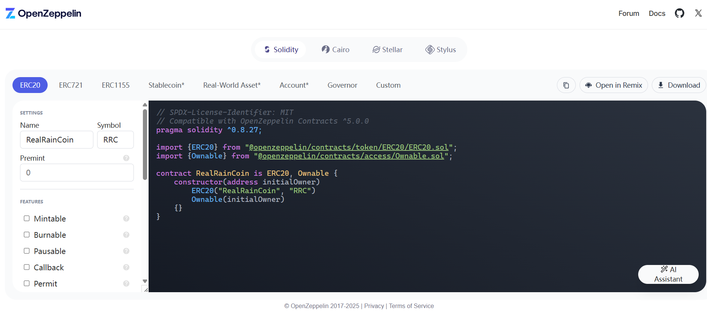

<!--
 * @Description: 智能合约项目初始化及测试指令
 * @Author: 真雨☔ 1936648485@qq.com
 * @Date: 2025-07-12 12:41:49
 * @LastEditors: 真雨☔ 1936648485@qq.com
 * @LastEditTime: 2025-07-12 13:21:21
 * @FilePath: \foundry_project\01_erc-20\contracts\doc\TestRealRainCoin\TestRealRainCoin.md
 * @X/Facebook: 1936648485@qq.com ~~~~~~~~~~~~~~~~~~~~~~~ Blog：reallyrain.com
 * Copyright (c) 2025 by real-rain, All Rights Reserved. 
-->
## 智能合约项目初始化及测试指令

详细用法参考 [Foundry 官方文档](https://getfoundry.sh/) 

### 初始化一个foundry项目
```shell
$ forge init
```

### 安装OpenZeppelin
[OpenZeppelin官网](https://www.openzeppelin.com/) ：内有 Solidity 中最全的标准库，官方文档中包含不同操作系统的安装方式，以及查看标准库中一些合约的源代码，同时主页有一个简易的合约定制工具，可以快速生成 ERC-20, ERC-721 等合约的模板
```shell
$ forge install OpenZeppelin/openzeppelin-contracts
```


### 在foundry.toml中重映射标准库的路径
```toml
remapping = ["@openzeppelin/contracts/=lib/openzeppelin-contracts/contracts/"]
```

### 格式化foundry代码的指令
```shell
$ forge fmt
```

### 编译合约
```shell
$ forge compile
```

### 测试合约
```shell
$ forge test
```

### 测试合约中指定的函数
```shell
$ forge test --mt testRevertIfUserMint
```

### 测试合约中指定的函数并展示详细信息
```shell
$ forge test --mt testRevertIfUserMint -vvvvv
```

### 测试合约的案例覆盖率
```shell
$ forge coverage
```
