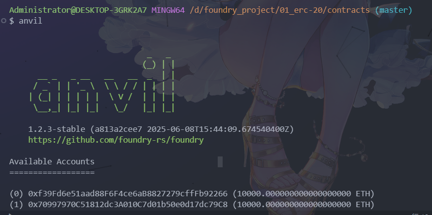
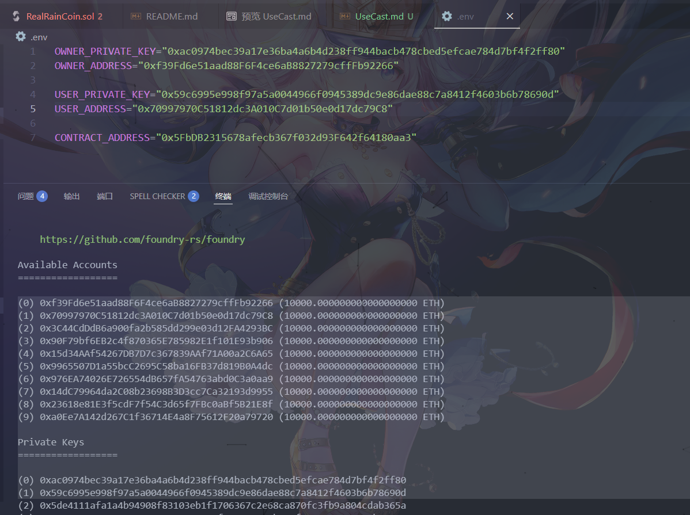
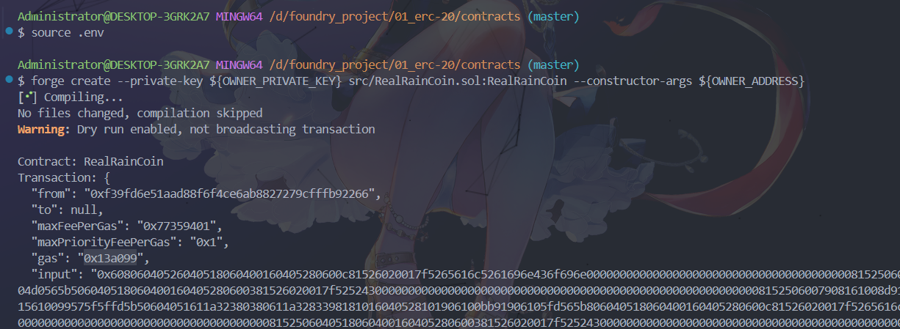
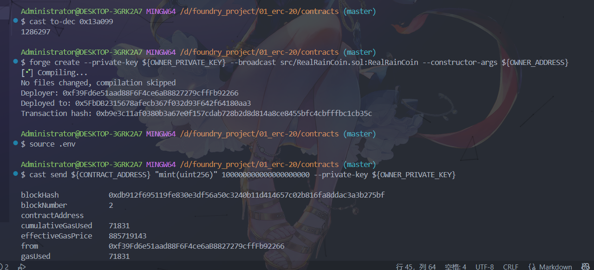
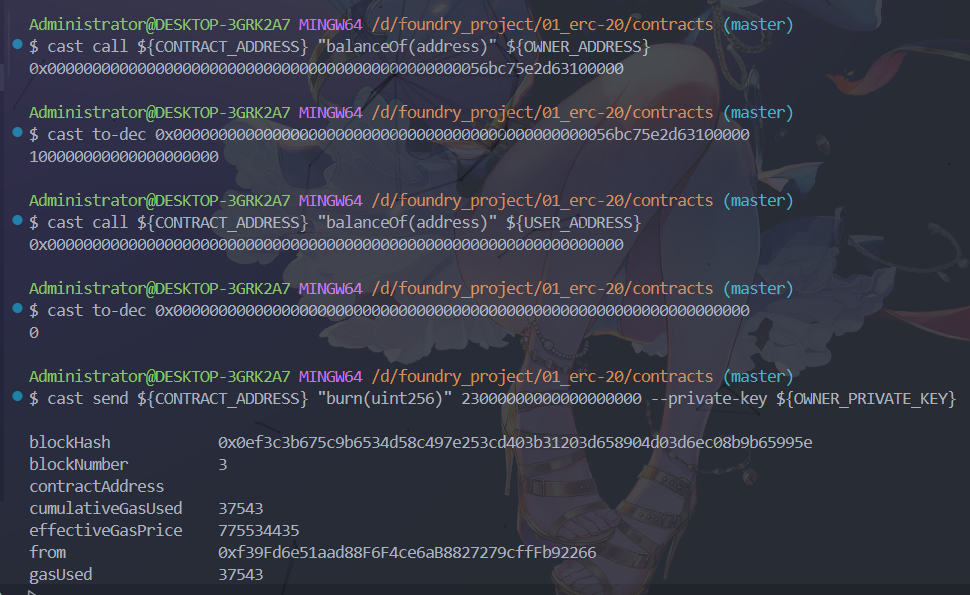
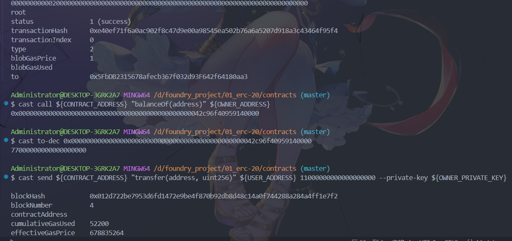
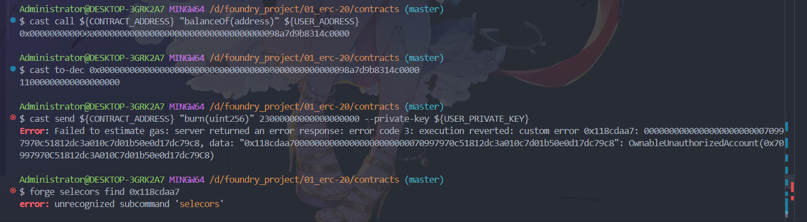
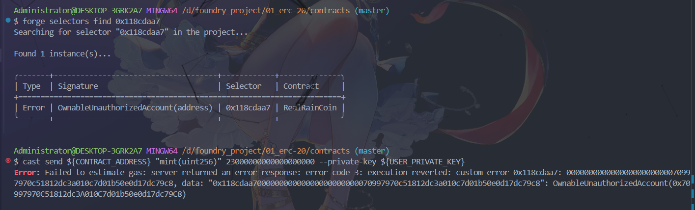
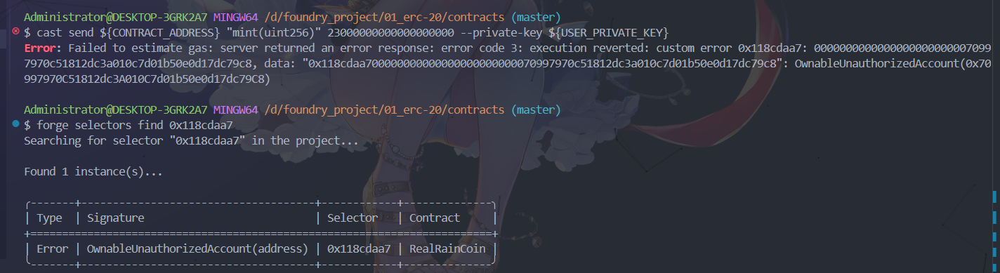

<!--
 * @Description: 合约部署并且使用cast与合约交互
 * @Author: 真雨☔ 1936648485@qq.com
 * @Date: 2025-07-08 23:45:27
 * @LastEditors: 真雨☔ 1936648485@qq.com
 * @LastEditTime: 2025-07-09 01:01:24
 * @FilePath: \contracts\doc\UseCast.md
 * @X/Facebook: 1936648485@qq.com ~~~~~~~~~~~~~~~~~~~~~~~ Blog：reallyrain.com
 * Copyright (c) 2025 by real-rain, All Rights Reserved. 
-->
## 合约部署并且使用cast与合约交互

一般使用 cast send 和 cast call 与智能合约进行交互，详细用法可以在 [Foundry 官方文档](https://getfoundry.sh/) - cast 概览中找到

### 运行一个本地的 anvil 节点
```shell
$ anvil
```


### 新建一个env配置文件 任意分配所有者和用户的私钥、账户地址
```shell
$ source .env
```


### 使用 forge create 部署合约
注意顺序：私钥 => 合约的路径 => 构造函数参数
```shell
$ forge create --private-key ${OWNER_PRIVATE_KEY} src/RealRainCoin.sol:RealRainCoin --constructor-args ${OWNER_ADDRESS}
```


### 使用 cast to-dec 可转换显示格式
```shell
$ cast to-dec 0x13a099
```
### 使用 --broadcast 加入广播可显示合约地址
```shell
$ forge create --private-key ${OWNER_PRIVATE_KEY} --broadcast src/RealRainCoin.sol:RealRainCoin --constructor-args ${OWNER_ADDRESS}
```
可在env配置记录一下合约地址，供前端交互。如Deployed to: 0x5FbDB2315678afecb367f032d93F642f64180aa3

### 使用 cast send 执行铸造函数（mint）为所有者铸造代币
默认最小单位是Wei，可通过官方的[以太坊 单位换算](https://eth-converter.com/)转换为Ether
```shell
$ cast send ${CONTRACT_ADDRESS} "mint(uint256)" 100000000000000000000 --private-key ${OWNER_PRIVATE_KEY}
```


### 使用 cast call 执行view函数（balanceOf），查询所有者余额
```shell
$ cast call ${CONTRACT_ADDRESS} "balanceOf(address)" ${OWNER_ADDRESS}
```
转换一下
```shell
$ cast to-dec 0x0000000000000000000000000000000000000000000000056bc75e2d63100000
```


### 使用 cast send 执行销毁函数（burn）为所有者销毁代币
```shell
$ cast send ${CONTRACT_ADDRESS} "burn(uint256)" 23000000000000000000 --private-key ${OWNER_PRIVATE_KEY}
```
再次查询所有者余额，应该剩下77个eth


### 使用 cast send 执行支付函数（transfer）给用户发送代币
```shell
$ cast send ${CONTRACT_ADDRESS} "transfer(address, uint256)" ${USER_ADDRESS} 11000000000000000000 --private-key ${OWNER_PRIVATE_KEY}
```
查询用户余额
```shell
$ cast call ${CONTRACT_ADDRESS} "balanceOf(address)" ${USER_ADDRESS}
```

### 使用 cast send 用户执行销毁函数（burn）应执行失败
```shell
$ cast send ${CONTRACT_ADDRESS} "burn(uint256)" 23000000000000000000 --private-key ${USER_PRIVATE_KEY}
```


### 使用 forge selectors 函数选择器查询错误代码的详细信息
```shell
$ forge selectors find 0x118cdaa7
```


### 同理使用 cast send 用户执行铸造函数（mint）也应执行失败
```shell
$ cast send ${CONTRACT_ADDRESS} "mint(uint256)" 23000000000000000000 --private-key ${USER_PRIVATE_KEY}
```

