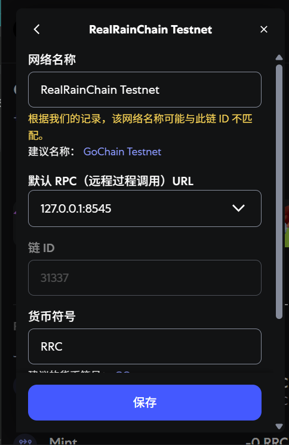
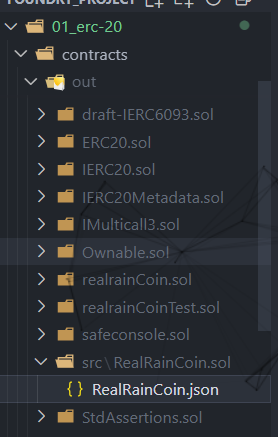
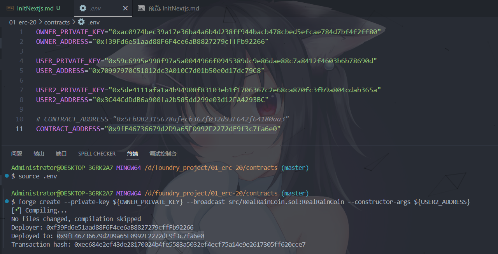
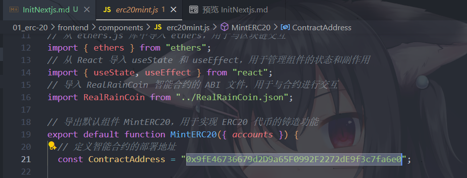
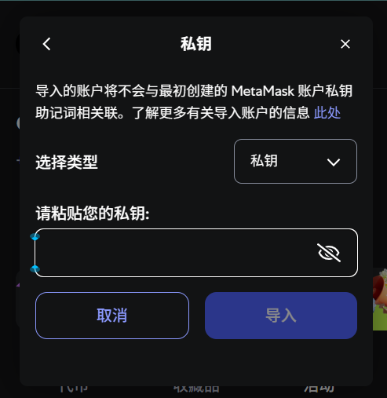
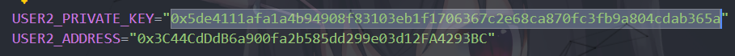
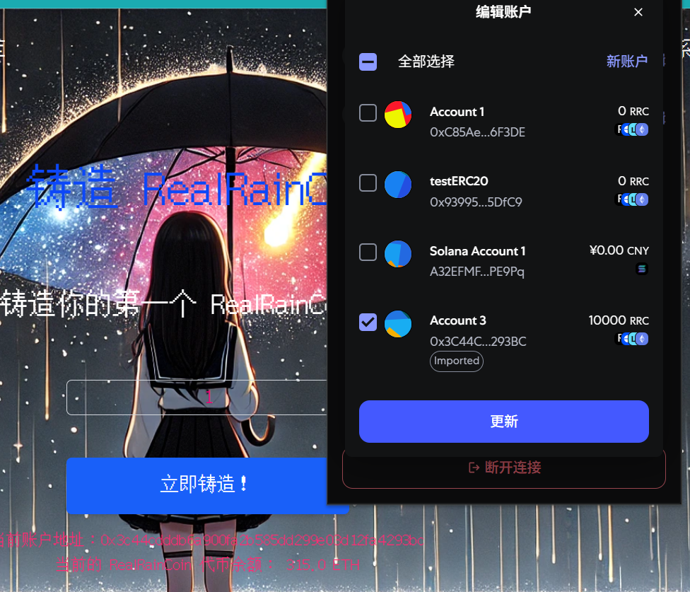

# 使用 ethers.js 让前端与合约交互
---
## 初始化`Next.js`项目
``` shell
npx create-next-app@latest
```

## 安装`ethers.js`
``` shell
npm install ethers
```

## 运行一个本地的 `anvil` 节点
``` bash
$ anvil
```

## 在浏览器插件中安装`MetaMask`钱包，并配置网络


## 从`foundry`项目中将智能合约`ABI`文件粘贴至前端项目，通常位于`out`目录


## 部署合约
```shell
$ source .env
```
```shell
$ forge create --private-key ${OWNER_PRIVATE_KEY} --broadcast src/RealRainCoin.sol:RealRainCoin --constructor-args ${USER2_ADDRESS}
```


## 同时更改前端项目的合约地址
 - **必须与部署地址一致**



## 在钱包中导入账户，并连接账户
 - **必须与用户私钥一致**




## 点击前端页面的立即铸造即可铸造代币


### 至此已完成，可在后端项目中销毁代币
```shell
$ cast send ${CONTRACT_ADDRESS} "burn(uint256)" 190000000000000000000 --private-key ${USER2_PRIVATE_KEY}
```