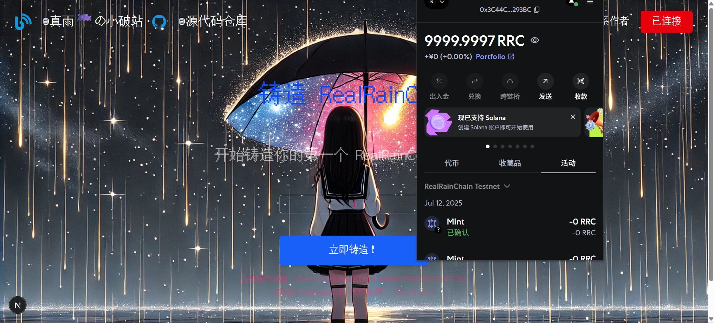

<!--
 * @Description: md
 * @Author: 真雨☔ 1936648485@qq.com
 * @Date: 2025-07-11 22:46:08
 * @LastEditors: 真雨☔ 1936648485@qq.com
 * @LastEditTime: 2025-07-12 15:04:06
 * @FilePath: \foundry_project\README.md
 * @X/Facebook: 1936648485@qq.com ~~~~~~~~~~~~~~~~~~~~~~~ Blog：reallyrain.com
 * Copyright (c) 2025 by real-rain, All Rights Reserved. 
-->
<h1 align="center"> 2025 年 Foundry 开发教程  </h1>

<strong>学习如何使用 Foundry 进行更深一步的 Solidity 智能合约开发  作者：realrain </strong>

 
<h1><strong>Warning: 本教程中构建的所有代码未经过严格审核，仅用于学习交流的目的，禁止在实际的生产环境中使用！！！！！！</strong></h1>
 
 

# RealRainCoin

## 参考文档
1. [Solidity 官方文档](https://docs.soliditylang.org/): 如果你有一定的编程基础，对一些 `Solidity` 基础变量的定义或语法的使用还不太了解，又不想花太多的时间去看视频教程，那么结合文档进行学习会是一个更不错的选择
2. [Foundry 官方文档](https://book.getfoundry.sh/): 这是使用 `Foundry` 框架进行 `Solidity` 智能合约开发必须要阅读的资料，同时当你真正开始构建生产级别应用时，可以在其中找到很多我并未在提及到的开发技巧和解决错误的方法
3. [OpenZeppelin官网](https://www.openzeppelin.com/): 内有 Solidity 中最全的标准库，官方文档中包含不同操作系统的安装方式，以及查看标准库中一些合约的源代码，同时主页有一个简易的合约定制工具，可以快速生成 ERC-20, ERC-721 等合约的模板

## 环境配置
1. 安装并配置 `git` 所需的环境
    - [git](https://git-scm.com/book/en/v2/Getting-Started-Installing-Git)
        - 安装成功后运行 `git --version`查看版本，截止 2025 年 7 月，使用的版本为 `2.50.0.windows.2`。

2. 安装并配置 `node` 运行所需的环境
    - [node.js](https://nodejs.org/zh-cn)
        - 安装成功后运行 `node -v` 查看版本，截止 2025 年 7 月，使用的版本为 `22.17.0`。
        - 运行 `npm -v`，查看 `npm` 包管理器的版本，截止 2025 年 7 月，使用的版本为 `10.9.2`。
        - 推荐使用`nvm`管理`node`版本，运行 `nvm -v`查看版本，截止 2025 年 7 月，使用的版本为 `1.2.2`。

## 合约部分的环境配置
1. 安装 `Rustup`: Foundry 运行必须的环境时
   - [rust](https://www.rust-lang.org/tools/install)
        - 安装成功后运行 `rustc --version`查看版本 ，截止 2025 年 7 月，使用的版本为 `rustc 1.88.0 (6b00bc388 2025-06-23)`

<!-- 2. 安装 `HomeBrew`, 很好用的包管理工具
   - [homebrew](https://brew.sh/)
        - 安装成功后可以运行 `brew --version` ，如果安装成功则显示 `Homebrew x.x.x`，截止 2025 年 7 月，使用的版本为 `Homebrew 4.4.14` -->

2. 安装并配置 `Foundry`
    - [foundry](https://getfoundry.sh/)
        - 安装成功后运行 `forge --version`查看版本 ，如果安装成功则显示 `forge x.x.x`，截止 2025 年 7 月，使用的版本为 `forge Version: 1.2.3-stable Commit SHA: a813a2cee7dd4926e7c56fd8a785b54f32e0d10f`

## 前端项目的环境配置
1. 安装[Next.js](https://nextjs.org/): 前端框架，当然你也可以选择 React，Vue，截止 2025 年 7 月，使用的版本为 `15.3.5`。
  - 在终端运行`npx create-next-app@latest` 初始化一个 Nextjs 项目，并根据自己的需求选择所需要的附加插件
  
2. 安装[tailwindcss](https://tailwindcss.com/docs/installation)，CSS框架，一般初始化Next项目时会提供选择，截止 2025 年 7 月，使用的版本为 `^4`。
  - 在终端运行`npm install -D tailwindcss npx tailwindcss init`,然后根据官网文档进行配置

3. 安装[Ethers](https://docs.ethers.org/v6/): 用于前端与合约之间的交互，截止 2025 年 7 月，使用的版本为 `^6.15.0`。

***更多详细的交互指令见contracts/doc目录文档***
  

<strong>
作者： realrain 
联系方式: 1936648485@qq.com 
Blog：<a href="https://reallyrain.com">真雨の小破站<a/> 
</strong>

